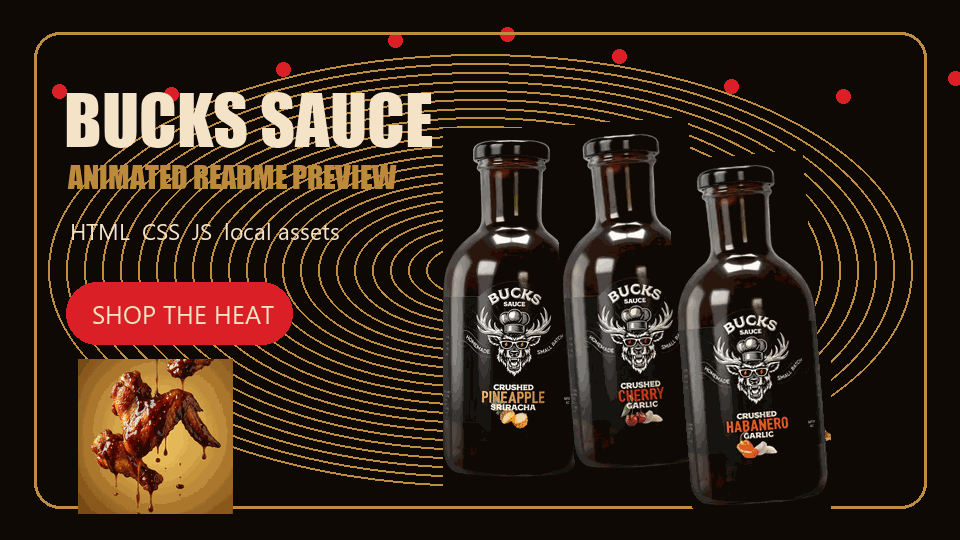

# Bucks Sauce Animated Website Recreation

A local, animated recreation of the Bucks Sauce homepage. It is built as a plain HTML, CSS, and JavaScript site with local assets, custom typography, responsive layouts, and motion inspired by the original sauce-heavy experience.

<p align="center">
  
</p>

## Animated Preview

The README includes a looping hero-style GIF generated from the same local product, food, and brand assets used by the website. It shows the sauce bottles floating, sauce dots moving, and the warm Bucks Sauce visual style before anyone opens the site.

## What This Includes

- Animated loading screen with the Bucks-style logo reveal and bouncing dots.
- Fixed header with rolling hover text links and pill buttons.
- Slide-out menu drawer and empty-cart drawer.
- Hero product carousel with animated bottles, food cutouts, sauce splash, and product copy.
- Split-letter title reveal animations.
- Scroll reveal sections for copy, benefits, product cards, and pack content.
- Sticky benefits area with ingredient callouts.
- Animated product cards with antler pattern movement and bottle hover lift.
- Horizontal scroll-style "Why Bucks Sauce" section.
- Buy-a-pack switcher for 3-pack and 6-pack states.
- Moving reviews marquee.
- Responsive mobile layout with drawer navigation.

## Animation Map

The main motion effects live in `styles.css` and `script.js`.

| Area | Animation |
| --- | --- |
| Loader | Logo pop-in, bouncing loading dots, clipped page reveal |
| Header | Rolling text hover effect, button lift |
| Hero | Auto-rotating product carousel, bottle float, mascot bob, food orbit |
| Text | Per-letter reveal using generated `.char` spans |
| Product Cards | Bottle lift on hover, moving antler background |
| Why Section | Horizontal track movement based on scroll progress |
| Packs | Pack image fade and slide when switching pack size |
| Reviews | Infinite marquee-style review track |
| Drawers | Menu/cart slide in with scrim overlay |

## File Structure

```text
bucks-sauce-clone/
  index.html       Main page markup
  styles.css       Layout, colors, typography, responsive rules, animations
  script.js        Carousel, drawers, scroll reveals, navigation, pack switcher
  assets/          Local images, icons, logo, fonts, and README preview GIF
```

## Run Locally

Open `index.html` directly in a browser, or serve the folder locally:

```bash
python -m http.server 8765
```

Then open:

```text
http://127.0.0.1:8765/
```

## Design Notes

The site uses the same general visual language as the reference:

- Dark BBQ-brown background: `#100b06`
- Warm cream foreground: `#f5e4c7`
- Gold accent: `#be8d3f`
- Red sauce accent: `#da1f27`
- Large uppercase display typography
- Rounded product panels
- Oversized product imagery
- Playful sauce-brand copy and motion

## Responsive Behavior

Desktop gets the full animated product and horizontal-section experience. Mobile keeps the core flavor but simplifies navigation into a drawer and stacks the major content blocks to avoid clipping or horizontal overflow.

## Usage Note

This is a local recreation for preview and development. Before publishing publicly or using commercially, confirm you have rights to use the Bucks Sauce brand, copy, imagery, logo, and product assets.
